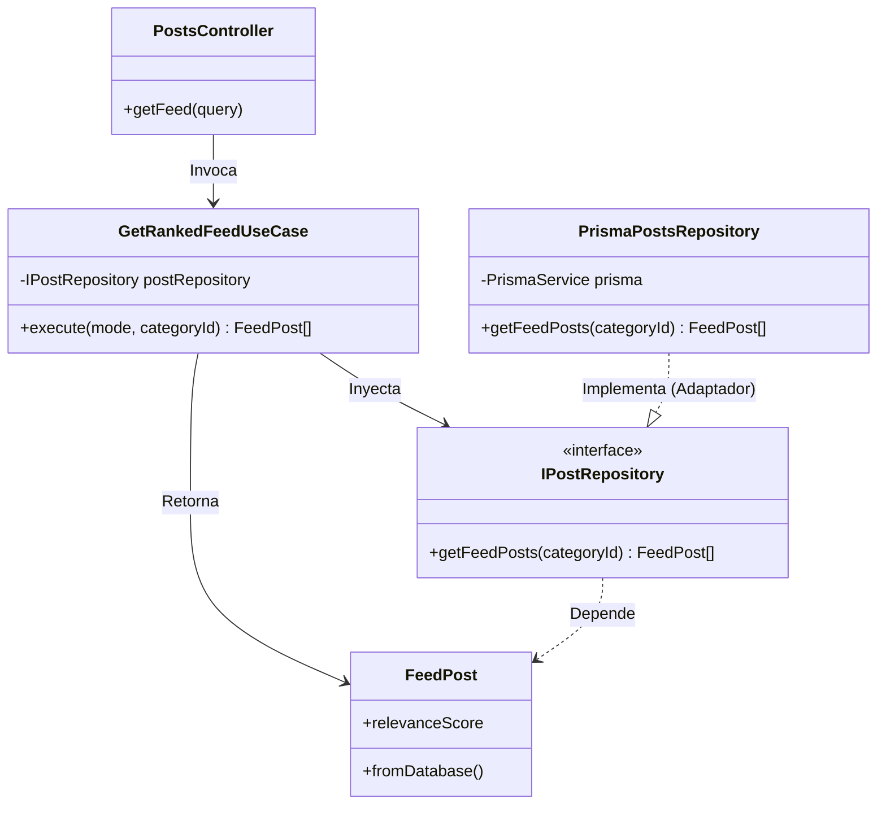

# Feed de Publicaciones

Este proyecto implementa un feed social sencillo, sin usuarios ni autenticación, centrado en la interacción entre publicaciones, likes y comentarios. La aplicación está pensada para simular una plataforma de contenido visual con lógica de negocio realista pero acotada.

## Requerimientos

- Docker

## Resumen funcional

El sistema permite crear publicaciones con imagen, texto y descripción, agruparlas en **categorías** (Tecnología, Arte, Ciencia, etc.) y mostrarlas en un feed central que se puede **filtrar por categoría**. Cada publicación puede recibir likes y comentarios, y esas interacciones modifican cómo se percibe su importancia dentro del feed.

El comportamiento general del producto gira alrededor de tres ideas:

- **contenido**: las publicaciones son la unidad principal del sistema,
- **interacción**: likes y comentarios enriquecen cada publicación,
- **priorización**: el feed puede cambiar de orden según distintos criterios de relevancia.

El feed admite **múltiples modos de ordenamiento** —más recientes, más populares, más comentados y relevancia— implementados mediante el patrón **Strategy**, lo que permite cambiar el criterio de priorización sin modificar la lógica central.

## Lógica de negocio principal

La lógica del sistema no solo guarda datos, también construye una vista enriquecida del feed. Para cada publicación se calcula información derivada, como la cantidad de interacciones y una puntuación de relevancia que combina actividad reciente con volumen de participación.

Además, antes de persistir publicaciones y comentarios se aplica una validación/moderación para filtrar contenido problemático. La moderación utiliza **expresiones regulares fuzzy** que detectan palabras prohibidas incluso con caracteres intermedios (por ejemplo, "s p a m"). Las palabras prohibidas se gestionan desde un **panel de administración** en `/admin.html`.

El sistema también ejecuta efectos operativos cuando se crean interacciones (por ejemplo trazas y procesos internos de recálculo), reflejando un flujo típico de aplicaciones de contenido.

## Contexto técnico

La solución está construida con NestJS en backend, Prisma ORM y SQLite como almacenamiento local.

La base de datos es fija en `sqlite.db`

## Ejecución:

Para levantar todo el sistema con Docker:

1. `make setup`
2. `make run`

Este comando construye la imagen, instala dependencias dentro del contenedor, aplica migraciones Prisma, genera el cliente y arranca NestJS en modo watch.

En este flujo, los artefactos de compilación y cache de paquetes se mantienen dentro de volúmenes Docker para no ensuciar el directorio del proyecto.

La aplicación queda disponible en:

- `http://localhost:3000`
- `http://localhost:3000/docs`
- `http://localhost:5555` (Prisma Studio - Database Manager)

Comandos útiles:

- `make stop` para detener el contenedor
- `make logs` para ver logs en tiempo real

---

## Refactorización hacia Clean Architecture

Hemos identificado y solucionado diversos problemas arquitectónicos en el proyecto original, avanzando hacia los principios de Clean Architecture:

### A. Acoplamiento directo al Framework (NestJS) y ORM (Prisma)
- **Problema**: Los servicios dependían directamente de `PrismaService`.
- **Solución**: Se implementó el patrón *Repository* con Inversión de Dependencias (DIP). Se definieron las interfaces `IPostRepository` e `ICommentRepository`, implementadas por los adaptadores `PrismaPostsRepository` y `PrismaCommentsRepository`. Se inyectan usando tokens.

### B. Mezcla de Excepciones del Framework con Lógica de Negocio
- **Problema**: Se arrojaban errores HTTP nativos (`BadRequestException`) dentro de las reglas de negocio.
- **Solución**: Se utilizaron excepciones puras de dominio (`BusinessRuleViolationError`, `ResourceNotFoundError`), desacoplando el negocio de detalles de transporte HTTP.

### C. Ausencia de Entidades del Dominio (Modelo Anémico)
- **Problema**: Uso directo de DTOs u objetos generados de Prisma. Lógica como el cálculo de `relevanceScore` estaba ligada al framework de persistencia.
- **Solución**: Se crearon las entidades puras `Post`, `FeedPost` y `Comment` encapsulando datos y comportamientos (como el *getter* `relevanceScore`). Los repositorios actúan como *Mappers* y construyen estas entidades a través del método `fromDatabase`.

**Ejemplo de Código Resumido:**
```typescript
export class FeedPost extends Post {
    likesCount!: number
    commentsCount!: number

    get relevanceScore(): number {
        // Lógica de negocio encapsulada
        return (this.likesCount * 2) + (this.commentsCount * 3)
    }

    static fromDatabase(prismaData: any): FeedPost {
        // Mapeo desde datos de Prisma a Entidad Pura
    }
}
```

### D. Violación de Responsabilidades en el Controlador (Orquestación del Feed)
- **Problema**: `PostsController` armaba y orquestaba la estrategia de ordenamiento llamando a la factoría y aplicando `rank()`.
- **Solución**: Se introdujo el Caso de Uso `GetRankedFeedUseCase`, extrayendo la orquestación fuera del controlador, dejándolo limpio y responsable únicamente del enrutamiento web.

**Diagrama de Clases (Arquitectura Resultante):**


### E. Acoplamiento entre Módulos (Dependencias Circulares Encubiertas)
- **Problema**: Servicios de distintos dominios (`LikesService`, `CommentsService`) dependían e inyectaban directamente a `PostsService` de otro módulo para validar la existencia de un post, acoplando los servicios de aplicación entre sí.
- **Solución**: Se aplicó el principio de Inversión de Dependencias (DIP) de forma cruzada. Ahora `LikesService` y `CommentsService` inyectan directamente la abstracción `IPostRepository` para verificar la existencia del post, eliminando el acoplamiento directo entre los servicios de negocio de diferentes módulos.

**Ejemplo de Código Resumido (`LikesService`):**
```typescript
@Injectable()
export class LikesService {
    constructor(
        @Inject(I_LIKE_REPOSITORY)
        private readonly likeRepository: ILikeRepository,
        @Inject(I_POST_REPOSITORY)
        private readonly postRepository: IPostRepository, // ✅ Abstracción en vez de PostsService
    ) {}

    private async assertPostExists(postId: string) {
        const post = await this.postRepository.findById(postId) // ✅ Consulta directa al puerto
        if (!post) {
            throw new ResourceNotFoundError("Post no encontrado")
        }
    }
}
```
